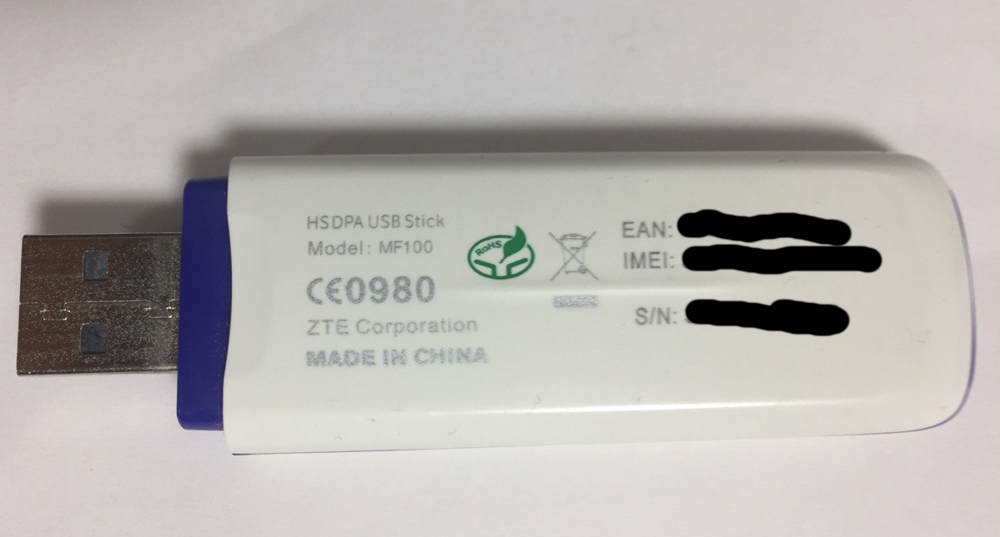
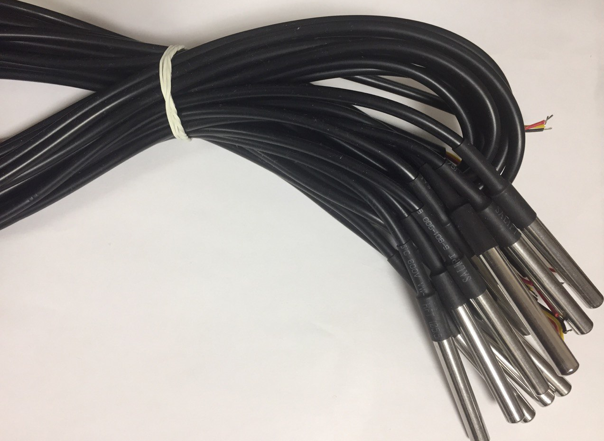
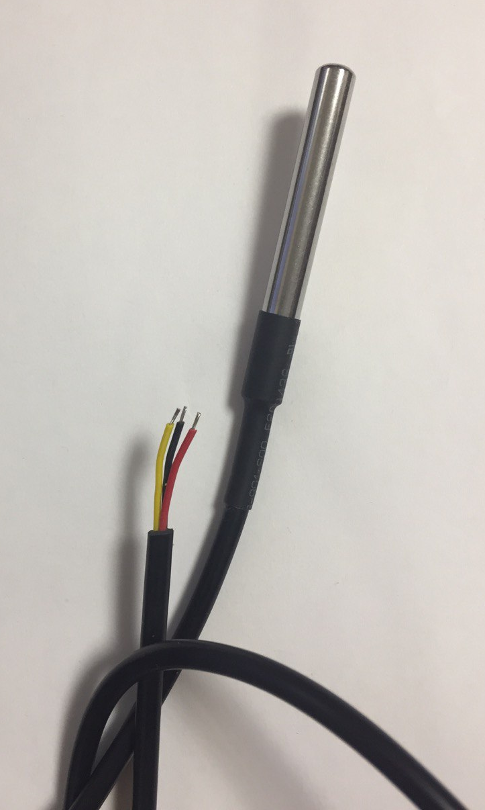

# Microcomputer board
Current system is based on Raspberry PI Zero v1.3 
but it can be any other with the following requirements
- sensors bus support
- internet connection (3G or WiFi or cable internet)

# 3G modem 
ZTE MF-100 + Data cable microUSB-USB (OTG)

# Temperature Sensor DS18B20 
(like Waterproof Digital Thermal Probe)

[Datasheet](https://datasheets.maximintegrated.com/en/ds/DS1822.pdf)

