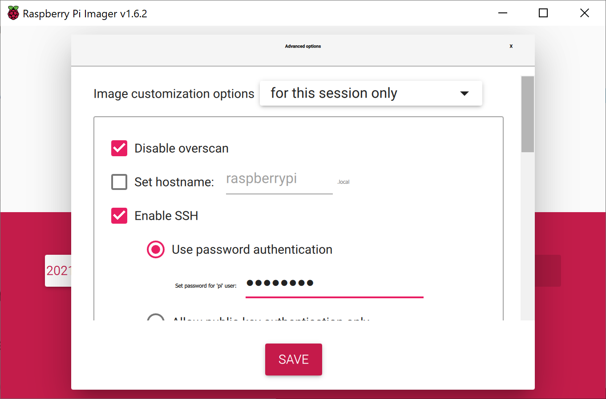
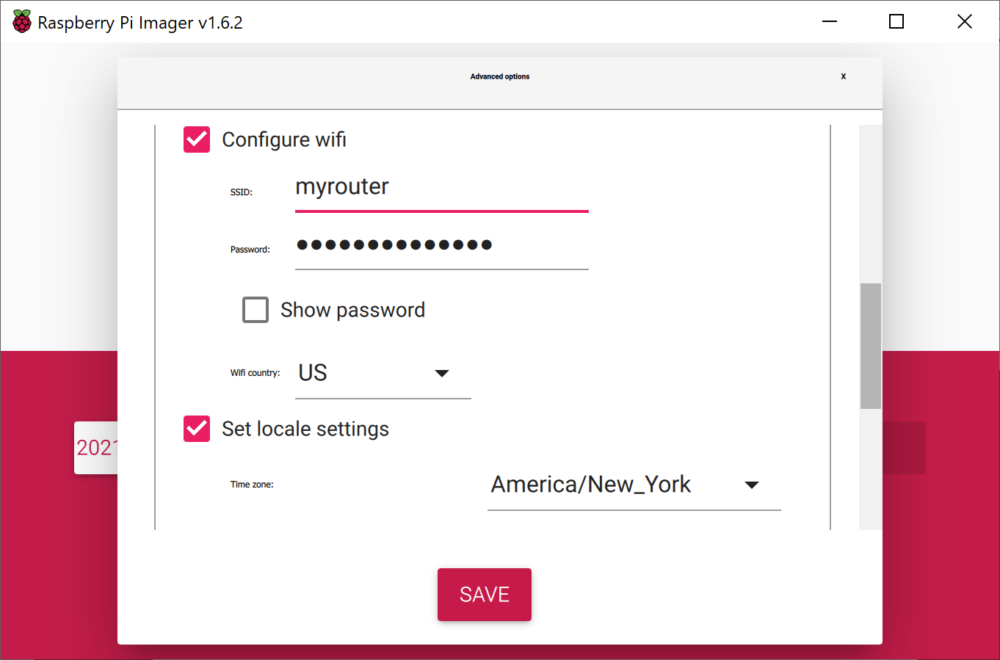
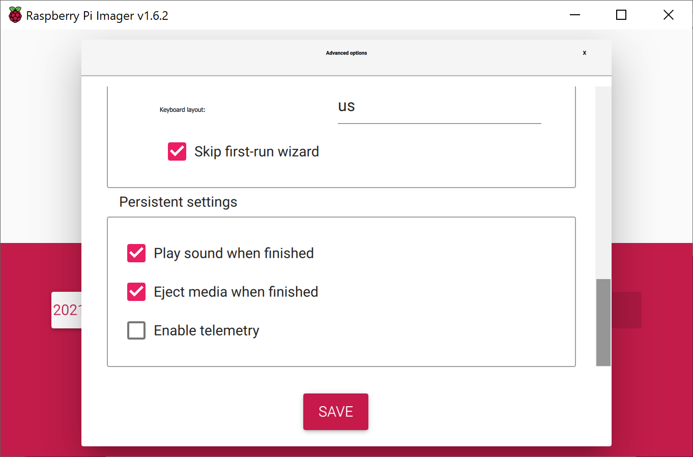

# System setup

## OS Raspberry OS 64 Lite

https://downloads.raspberrypi.org/raspios_lite_arm64/images/

Select the latest version and download zip file with OS image.


Download and install [Raspberry PI Imager](https://www.raspberrypi.com/software/) software and run it.


To choose OS image click on Choose OS and select "Use Custom"


And then choose downloaded zip file


Click on Choose Storage to select SD card


Click Ctrl+Shift+X to display Advanced Options

Disable Ovescan, set hostname (if youlike), enable SSH and set the password for the "pi" user



Configure WiFi connection (of course in case if you will use USB WiFi stick) by set SSID and password,
set locale settings



Set "Skip first-run wizard", and set "Eject media when finished"



Click on Write to write the image to the selected SD card


Boot the system, and enable the One-Wire interface (Check more details about it [here](https://pinout.xyz/pinout/1_wire))

```console
sudo nano /boot/config.txt
```

and add this to the bottom of the file:

dtoverlay=w1-gpio

Exit Nano with saving changes and reboot

```console
sudo reboot
```

Now enable modules w1-gpio and w1-therm

```console
sudo modprobe w1-gpio
sudo modprobe w1-therm
```

Now you will be able to see your temperarure sensor(s)

```console
ls /sys/bus/w1/devices
```

To work with GPIO from Python need to install RPi.GPIO

```console
sudo apt-get update
sudo apt-get install python3-rpi.gpio
sudo pip3 install RPi.GPIO
```

To use DHT11 sensor (humiture & temperature module) need to install Adafruit library

```console
git clone https://github.com/adafruit/Adafruit_Python_DHT.git
cd Adafruit_Python_DHT
sudo apt-get install build-essential python-dev
sudo python3 setup.py install
```

To use Barometer sensor (BMP180) need to setup I2C bus

```console
sudo nano /etc/modules
```

Add the following lines

```console
i2c-bcm2708
i2c-dev
```

Enable I2C and reboot

```console
sudo raspi-config
Interface Options->P5 I2C->Enable->Yes
sudo reboot
```

## RRD Tool

[About RRD Tool](https://www.mrtg.org/rrdtool/)

Install dependencies (see more details [here](https://pythonhosted.org/rrdtool/install.html#debian-ubuntu))

```console
sudo apt-get install librrd-dev libpython3-dev
```

Install PIP

```console
sudo apt-get install pip
```

Install RDD Tool

```console
sudo apt-get install rrdtool
sudo pip install rrdtool
```
