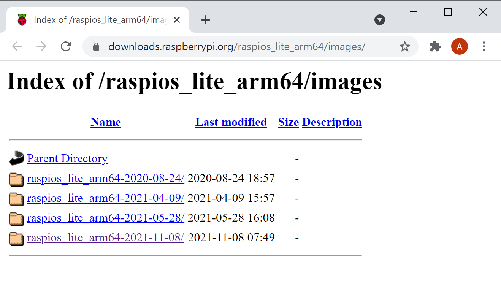
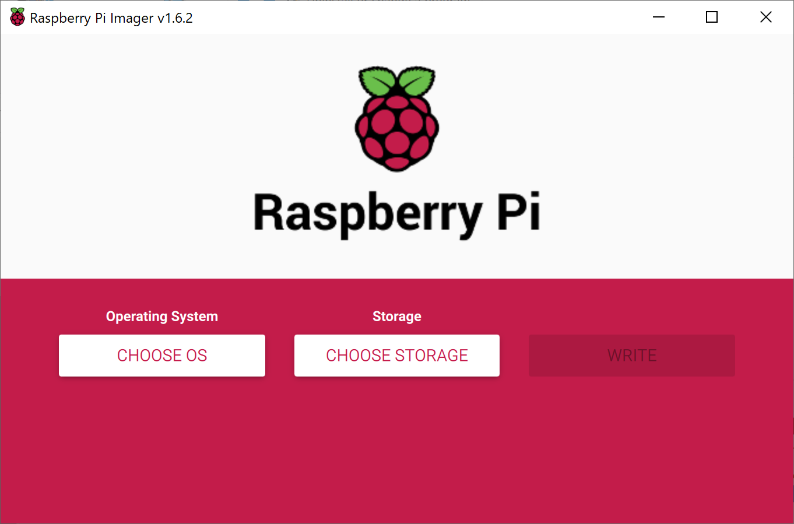
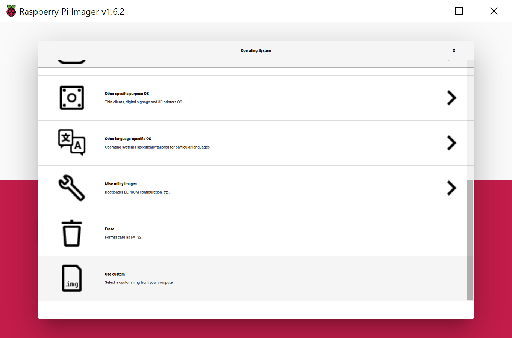
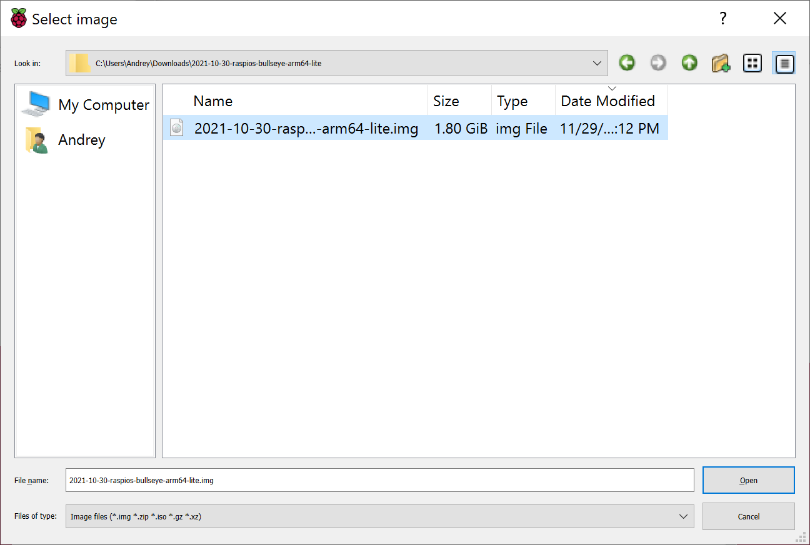
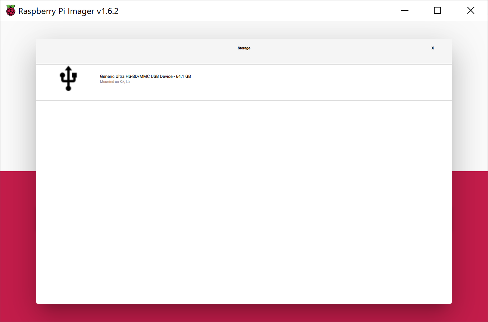
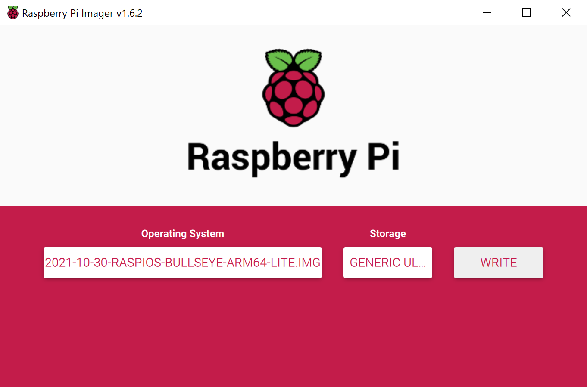
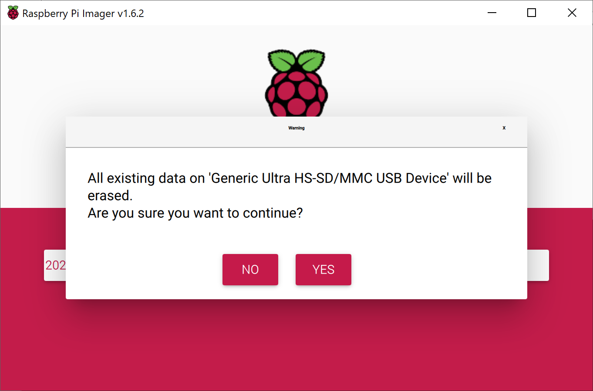
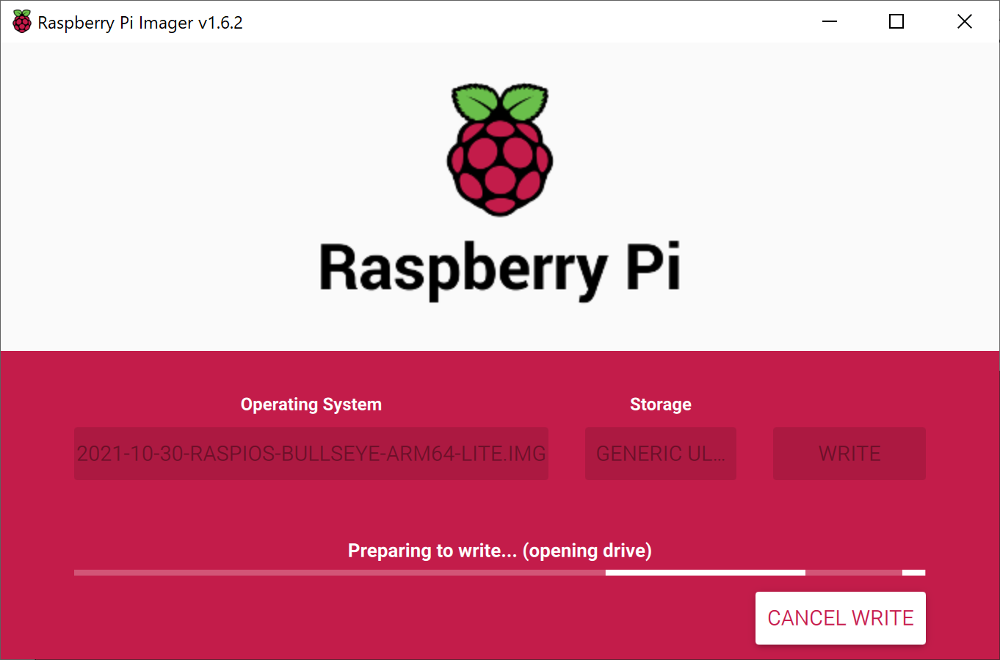
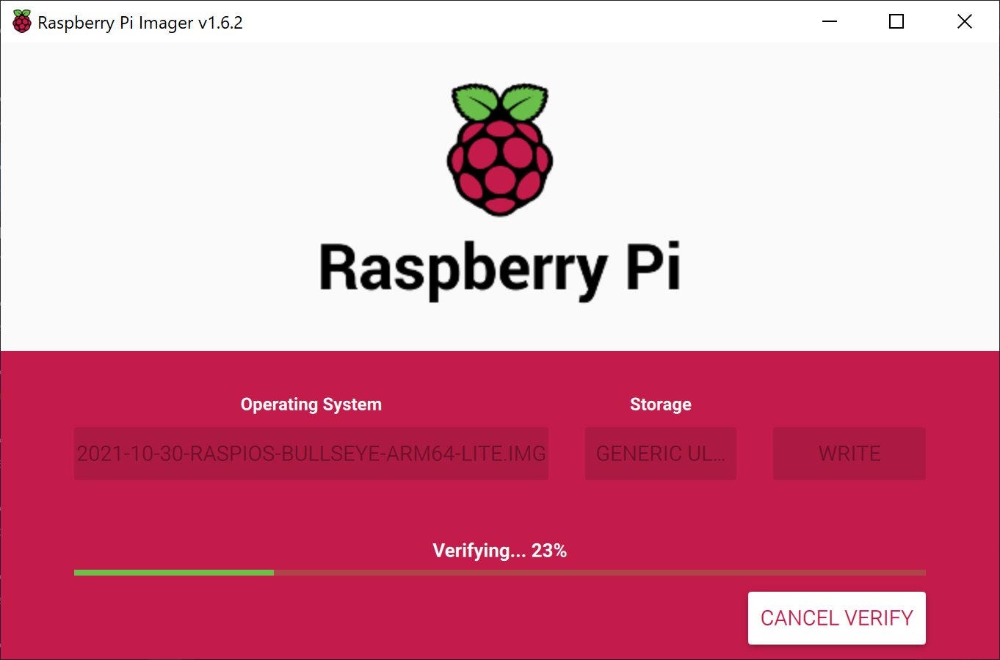
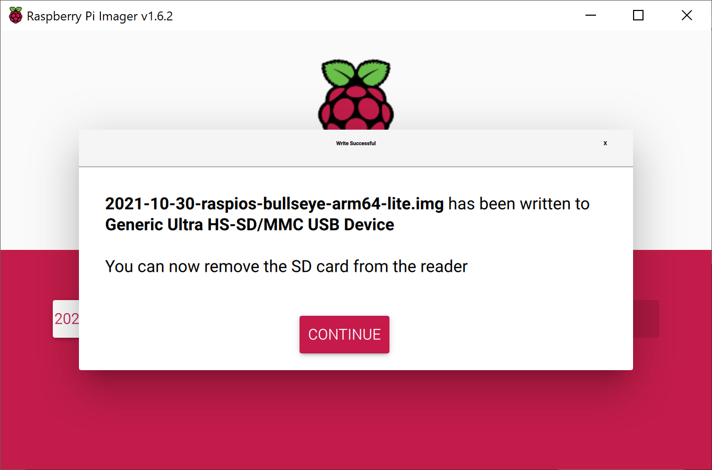

## OS Raspberry OS 64 Lite

https://downloads.raspberrypi.org/raspios_lite_arm64/images/

Select the latest version and download zip file with OS image.

Download and install [Raspberry PI Imager](https://www.raspberrypi.com/software/) software and run it.

To choose OS image click on Choose OS and select "Use Custom"

And then choose downloaded zip file

Click on Choose Storage to select SD card

Click on Write to write the image to the selected SD card

Now remove your SD card and insert again

Add empty file with name ssh to enable SSH

Add file wpa_supplicant.conf with the following details to enable WiFi connection

<code>

country=US

ctrl_interface=DIR=/var/run/wpa_supplicant GROUP=netdev

network={

    ssid="YOUR_NETWORK_NAME"

    psk="YOUR_PASSWORD"

    key_mgmt=WPA-PSK

}

</code>
